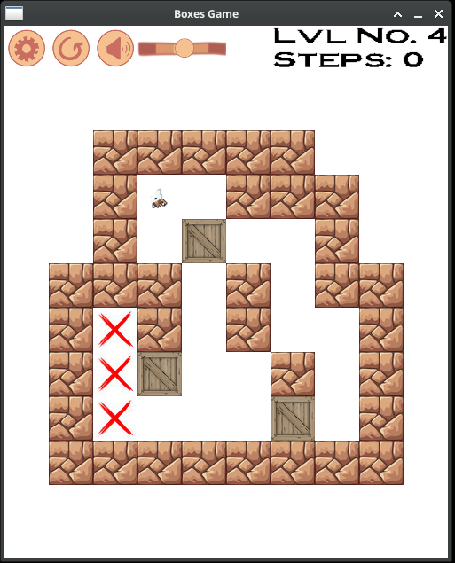
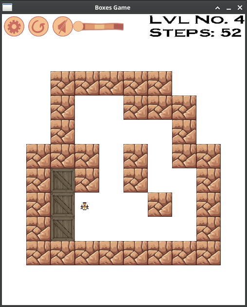

# Boxes game
### A simple game to play and code. 

The idea of this game is copied from the **Boxxle** game — a puzzle video game released by Fujisankei Communications International for the Game Boy in 1989 and Game Gear in 1990.

## The rules: 
- Use arrows to move the Bee;
- Move all the boxes to their destinations;
- When all the boxes are in place, you win!

## Preview

### Level at the beginning:

### Level completed, the Bee is happy:

**There 12 levels in total. Complete all to clear the game and make the Bee happy :)**